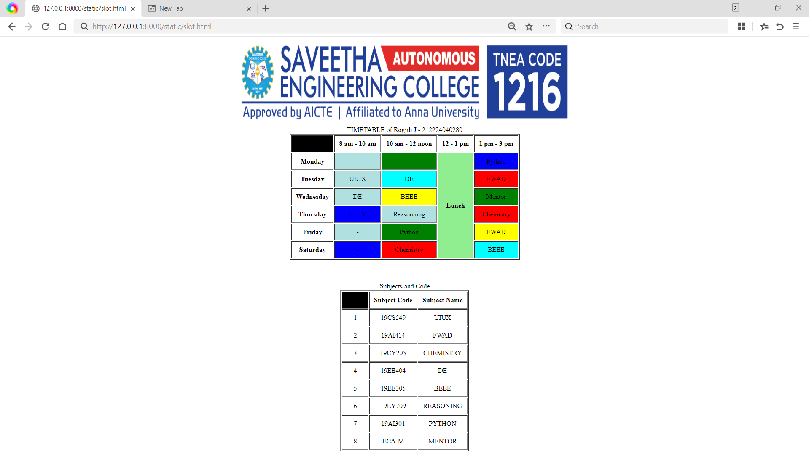

# Ex03 Time Table
## Date:
25/04/2025
## AIM
To write a html webpage page to display your slot timetable.

## ALGORITHM
### STEP 1
Create a Django-admin Interface.

### STEP 2
Create a static folder and inert HTML code.

### STEP 3
Create a simple table using ```<table>``` tag in html.

### STEP 4
Add header row using ```<th>``` tag.

### STEP 5
Add your timetable using ```<td>``` tag.

### STEP 6
Execute the program using runserver command.

## PROGRAM

```
<!DOCTYPE html>
<html>
    <header><center></center></header>
    <body>
        <table align="center" border="2" cellpadding="10">
            <caption>TIMETABLE of Rogith J - 212224040280</caption>
            <tr>
                <th bgcolor="Black"></th><th>8 am - 10 am</th><th>10 am - 12 noon</th><th>12 - 1 pm</th><th>1 pm - 3 pm</th>
            </tr>
            <tr>
                <th>Monday</th>
                <td align="center" bgcolor="biege">-</td>
                <td align="center" bgcolor="green">-</td>
                <th rowspan="6"bgcolor="lightgreen">Lunch</th>
                <td align="center" bgcolor="blue">Python</td>
            </tr>
            <tr>
                <th>Tuesday</th>
                <td align="center" bgcolor="biege">UIUX</td>
                <td align="center" bgcolor="cyan">DE</td>
                <td align="center" bgcolor="red">FWAD</td>
            </tr>
            <tr>
                <th>Wednesday</th>
                <td align="center" bgcolor="biege">DE</td>
                <td align="center" bgcolor="yellow">BEEE</td>
                <td align="center" bgcolor="green">Mentor</td>
            </tr>
            <tr>
                <th>Thursday</th>
                <td align="center" bgcolor="blue">UIUX</td>
                <td align="center" bgcolor="biege">Reasonning</td>
                <td align="center" bgcolor="red">Chemistry</td>
            </tr>
            <tr>
                <th>Friday</th>
                <td align="center" bgcolor="biege">-</td>
                <td align="center" bgcolor="green">Python</td>
                <td align="center" bgcolor="yellow">FWAD</td>
            </tr>
            <tr>
                <th>Saturday</th>
                <td align="center" bgcolor="blue">-</td>
                <td align="center" bgcolor="red">Chemistry</td>
                <td align="center" bgcolor="cyan">BEEE</td>
            </tr>
        </table>
        <br><br><br>
        <table align="center" border="2" cellpadding="10">
            <caption>Subjects and Code</caption>
            <tr>
                <th bgcolor="Black">S. No.</th><th>Subject Code</th><th>Subject Name</th>
            </tr>
            <tr>
                <td align="center">1</td>
                <td align="center">19CS549</td>
                <td align="center">UIUX</td>
            </tr>
            <tr>
                <td align="center">2</td>
                <td align="center">19AI414</td>
                <td align="center">FWAD</td>
            </tr>
            <tr>
                <td align="center">3</td>
                <td align="center">19CY205</td>
                <td align="center">CHEMISTRY</td>
            </tr>
            <tr>
                <td align="center">4</td>
                <td align="center">19EE404</td>
                <td align="center">DE</td>
            </tr>
            <tr>
                <td align="center">5</td>
                <td align="center">19EE305</td>
                <td align="center">BEEE</td>
            </tr>
            <tr>
                <td align="center">6</td>
                <td align="center">19EY709</td>
                <td align="center">REASONING</td>
            </tr>
            <tr>
                <td align="center">7</td>
                <td align="center">19AI301</td>
                <td align="center">PYTHON</td>
            </tr><tr>
                <td align="center">8</td>
                <td align="center">ECA-M</td>
                <td align="center">MENTOR</td>
            </tr>
        </table>
    </body>
</html>
```

## OUTPUT

INCLUDE YOUR OUTPUT IMAGE



## RESULT
The program for creating slot timetable using basic HTML tags is executed successfully.
